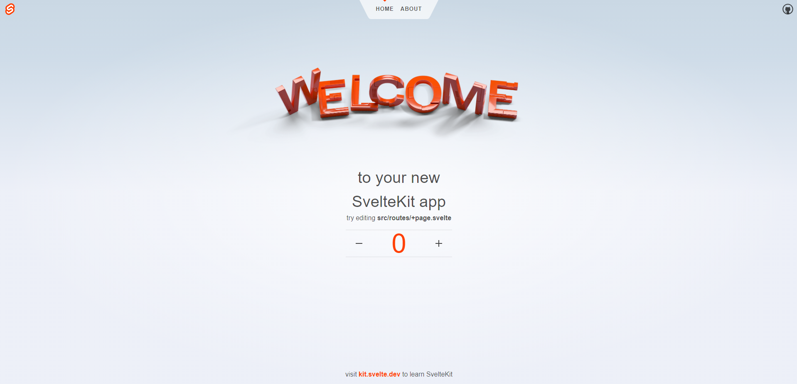

<!--  -->



<!-- shield.io, 'project built with' -->

 

"[Svelte](https://svelte.dev/) is a tool for building web applications. Like other user interface frameworks, it allows you to build your app _declaratively_ out of components that combine markup, styles, and behaviours."

"[SvelteKit](https://kit.svelte.dev/) is a framework for rapidly developing robust, performant web applications using Svelte. If you're coming from React, SvelteKit is similar to Next. If you're coming from Vue, SvelteKit is similar to Nuxt."

This guide provides a first-hand experience on building a Svelte project using [SvelteKit](https://kit.svelte.dev/docs/introduction) + [Tailwind CSS](https://tailwindcss.com/docs/guides/sveltekit) and deploying it on [GitHub Pages](https://pages.github.com/).

## 🛠️ Installation

**1. Create your project.**

```bash
 # terminal
 npm create svelte@latest project_name
 cd project_name
```

**2. Install Tailwind CSS.**

```bash
 # terminal
 npm install -D tailwindcss postcss autoprefixer
 npx tailwindcss init -p
```

**3. Enable use of PostCSS in \<style> blocks.** <small>[reference here](https://tailwindcss.com/docs/guides/sveltekit)</small>

```js
// svelte.config.js
import adapter from '@sveltejs/adapter-auto';
import { vitePreprocess } from '@sveltejs/vite-plugin-svelte';

/** @type {import('@sveltejs/kit').Config} */
const config = {
	kit: {
		adapter: adapter()
	},
	preprocess: vitePreprocess()
};

export default config;
```

**4. Configure your template paths.**

```js
// tailwind.config.js
/** @type {import('tailwindcss').Config} */
export default {
	content: ['./src/**/*.{html,js,svelte,ts}'],
	theme: {
		extend: {}
	},
	plugins: []
};
```

**5. Add the Tailwind directives to your CSS.** `./src/app.css`

```css
/* app.css */
@tailwind base;
@tailwind components;
@tailwind utilities;
```

**6. Import the CSS file.** `./src/routes/+layout.svelte`

```html
<!-- +layout.svelte -->
<script>
	import '../app.css';
</script>

<slot />
```

**7. Start your build process.**

```bash
 npm run dev
```

**8. Start coding.**

```html
<h1 class="text-3xl font-bold underline">Hello world!</h1>

<style lang="postcss">
	:global(html) {
		background-color: theme(colors.gray.100);
	}
</style>
```

## 🗂️ File Structure

Typical file structure.

```
my-project/
├─ src/
│  ├─ lib/
│  │  ├─ server/
│  │  │  └─ [your server-only lib files]
│  │  └─ [your lib files]
│  ├─ params/
│  │  └── [your param matchers]
│  ├─ routes/
│  │  ├─ +layout.svelte
│  │  ├─ +page.svelte
│  │  └─ [your routes]
│  ├─ app.html
│  ├─ app.css
│  ├─ error.html
│  ├─ hooks.client.js
│  ├─ hooks.server.js
│  └─ service-worker.js
├─ static/
│  └─ [your static assets]
├─ tests/
│  └─ [your tests]
├─ package.json
├─ svelte.config.js
├─ tsconfig.json
└─ vite.config.js
```

## 🛫 How to deploy to GitHub Pages

Deploying to github pages is totally up to you, be it through **[GitHub Actions](https://docs.github.com/en/actions/deployment/about-deployments/deploying-with-github-actions)**, or via **[gh-pages](https://www.npmjs.com/package/gh-pages)** without jekyll, or manually.

> [!NOTE]
>
> - Take note of the specific configurations for your project before deploying it, otherwise, it won't work properly on production. Refer to the documentations for [Svelte](https://svelte.dev/docs/introduction) or [SvelteKit](https://kit.svelte.dev/docs/introduction).
> - Also take note that [GitHub Pages](https://pages.github.com/) have limitations, it's free, yes, but it has a limit.

### ❗ via package without the use of Jekyll SSG ❗

**1. Install `gh-pages` package.**

```bash
npm install gh-pages --save-dev
```

**2. Add `.nojekyll` file to your `static/` directory.**

> [!IMPORTANT]  
> It is important that the **.nojekyll file** is present in the _gh-pages_ branch for the project deployment to work properly.

**3. Add `deploy` to your scripts.**

```json
{
	"scripts": {
		"deploy": "npm run build && gh-pages -d build -t true"
	}
}
```

`-t true` flag addition is based on this [discussion](https://github.com/tschaub/gh-pages/issues/315) regarding the the dotfiles (.nojekyll) not being pushed in the repo for deployment.

**4. Create and configure a new branch for `gh-pages`.**
I like to do this manually. If there is some automated way, feel free to let me know by any means.

```bash
git checkout --orphan gh-pages
git reset --hard
git commit --allow-empty -m 'commit_message'
git push origin gh-pages
```

**5. Publish the production build.**

```bash
npm run deploy
```

### ❗ via manually configuring github pages settings ❗

**1. Create your project.**
Start coding your project, either use a framework like React, Vue, or not.

**2. Publish production build to GitHub.**
Push your _production build_ to your github repo. After that, check if your `index.html` file is uploaded, since it is one of the core files needed for your website to work.

**3. Configure your GitHub Pages on repo Settings.**
Navigate to `Settings > Pages > Build and deployment`. Make sure the _Source_ says 'Deploy from a branch', and then configure the _Branch_ settings and change it to your branch with the files.

---

🌎 [kerbethecoder](https://kerbethecoder.com/)  
📫 krby.cnts@gmail.com  
📌 July 26, 2024
